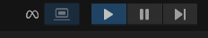

# TranslatAR

## Prerequisites

- About 50 GB of free space.
- [Docker Desktop](https://docs.docker.com/desktop/) installed and running.
- **A Bash-compatible terminal.**
  - **macOS/Linux:** Use the default Terminal.
  - **Windows:** Use **Git Bash** (included with [Git for Windows](https://git-scm.com/download/win)) or [WSL](https://learn.microsoft.com/en-us/windows/wsl/install).
- **`make` command-line tool.**
  - **macOS:** `make` is pre-installed. You may need to install Xcode Command Line Tools by running `xcode-select --install`.
  - **Windows:** `make` is available through various packages. The easiest way is to install it via [Chocolatey](https://chocolatey.org/): `choco install make`.
  - **Linux (Debian/Ubuntu):** `sudo apt update && sudo apt install make -y`
- [Unity Hub](https://docs.unity3d.com/hub/manual/InstallHub.html). The [Unity Set Up Guide](#unity-frontend) will instruct you on how to install Unity version `2022.3.62f1`.
- For running the Unity frontend, a Windows PC or Apple Silicon Mac is required.

- **(Optional) For GPU acceleration:**
  - A [CUDA-capable NVIDIA GPU](https://developer.nvidia.com/cuda-gpus).
  - [NVIDIA Container Toolkit](https://docs.nvidia.com/datacenter/cloud-native/container-toolkit/install-guide.html) installed.  

## Common Commands

This project uses a `Makefile` to provide simple commands for common operations. You can run `make` at any time to see a list of all available commands.

| Command                 | Description                                                                         |
| ----------------------- | ----------------------------------------------------------------------------------- |
| `make up`               | Build and start all services in Docker (auto-detects GPU).                          |
| `make down`             | Stop and remove all services.                                                       |
| `make restart`          | A shortcut to stop and restart all services.                                        |
| `make logs`             | Show logs of all running services.                                                  |
| `make logs <service>`   | Show logs of a specific service (e.g., `backend`).                                  |
| `make unity-editor`     | Open the Unity project (`unity/`) in the Unity Edtitor (requires macOS or Windows). |
| `make test`             | Run all applicable test suites (Unit, Integration, and Unity).                      |
| `make test-unit`        | Run only the unit tests for all backend services.                                   |
| `make test-integration` | Run only the backend integration tests.                                             |
| `make test-unity`       | Run only the Unity tests (requires macOS or Windows).                               |
| `make check`            | Alias for `make format` + `make lint`.                                              |
| `make format`           | Format all Python and web portal source code.                                       |
| `make lint`             | Lint all Python and web portal source code.                                         |
| `make help` or `make`   | Show help message (same info as this table).                                        |

## Further Documentation

-   **Service-Specific READMEs:** Each microservice has its own `README.md` with information about its tech stack, dependency management, and local testing procedures.
    -   [Backend Service](./backend/README.md)
    -   [Web Portal](./web-portal/README.md)
    -   [Speech-to-Text Service](./stt-service/README.md)
    -   [Translation Service](./translation-service/README.md)
    -   [Summarization Service](./summarization-service/README.md)
    -   [Unity Frontend](./unity/README.md)

-   **Developer Guides:**
    -   [Python Services Development Guide](./docs/developer_guide.python_services.md)
    -   [VS Code Dev Containers Guide](./docs/dev_container.md)

- **Live API Documentation (FastAPI):** The FastAPI Python services automatically generate interactive API documentation. Once the services are running (`make up`), you can access them at:
  - **Backend Service**:
    - **Swagger UI:** <http://localhost:8000/docs>
    - **ReDoc:** <http://localhost:8000/redoc>

  - **Speech-to-Text Service:**
    - **Swagger UI:** <http://localhost:9000/docs>
    - **ReDoc:** <http://localhost:9000/redoc>

  - **Translation Service:**
    - **Swagger UI:** <http://localhost:9001/docs>
    - **ReDoc:** <http://localhost:9001/redoc>

  - **Summarization Service:**
    - **Swagger UI:** <http://localhost:9002/docs>
    - **ReDoc:** <http://localhost:9002/redoc>

## Set Up

### Initial set up

First, ensure all [prerequisites](#prerequisites) are met and Docker is running.

1. Clone this repository and enter the directory:

    ```sh
    git clone https://github.com/TransatAR-Dev-Team/TranslatAR.git && cd TranslatAR
    ```

2. Start all the backend services. This runs a script that will automatically detect if you have an NVIDIA GPU and apply the correct configuration. The first time you run this, it may take a while to download and build the Docker images.

    ```sh
    make up
    ```

3. Go to <http://localhost:5173> (Web Portal) and <http://localhost:8000/docs> (Backend Auto Documentation) to verify the containers are running.

4. If this is your first time setting up the project, download the LLM model for the summarization service. You only need to do this once.

    ```sh
    docker exec -it ollama ollama pull phi3:mini
    ```

### Unity Frontend

1. Install [Unity Hub](https://docs.unity3d.com/hub/manual/InstallHub.html)

    > Unity Hub has a [CLI tool](https://docs.unity3d.com/hub/manual/HubCLI.html) that can do everything needed to set up the environment. This guide will continue without using the CLI tool.

2. Open *Projects* tab and click *Add ⌄*

3. In the dropdown, select *Add project from disk*

4. Locate this repository in your file system and select the `unity` directory

5. Download Unity version `2022.3.62f1` from the pop up. It should be the recommended version.

6. In the pop up, select *Android build support* and all subitems to be installed as well.

7. Click *Install*. This may take a while to download.

8. Open the project in Unity Hub from the "Projects" list. The project should look like a blank 3D area with a floating text box.

9. In the Unity Editor's taskbar, check *Meta* > *Meta XR Simulator* > *Activate*

    > Leaving *Meta XR Simulator* set to *Deactivate* only renders the subtitle box in 2D and saves resources.

10. Ensure the "Laptop" button next to the transpot buttons is blue. This runs the app on the headset simulator. Example:

    

## Demo

### Running the demo

To demonstrate the connection between the containerized backend and the Unity frontend, first ensure all [Set Up](#set-up) steps are completed.

1. Press the "Play" button (`▶`) at the top center of the Unity editor window to start the scene.

2. A pop up with the headset simulator should appear.

   > The room you see in the pop up simulates the video passthrough feature of a real Meta Quest headset, where you would instead see your actual physical surroundings through the device's cameras.

   The text on the simulator screen will prompt you: *"Press and hold (B) or Left Click to record."*.

   Walk around with `W`, `A`, `S`, and `D` keys. Look around with the arrow keys.

3. **Click your mouse inside the simulator window** to give it focus.

4. **Press and hold the `B` button**. The text will change to *"Recording..."*. Speak into your computer's microphone.

5. **Release the `B` button**. The text will change to *"Processing audio..."*.

6. After a moment, the text will update with the Spanish translation of what you said.

7. Go to <http://localhost:5173> to see the web portal. The new translation you just created will be at the top of the history log.

8. Repeat steps 4-6 to add more translations. Refresh the web portal to see the history update.

9. Type/copy some text into the "Summarize Text" text box on the web portal. Select a summary length (short, medium, long) and click the "Summarize" button. A summary of the text will be generated.

### Data flow demonstrated

#### Translation

1. The user presses and holds a button in the Unity frontend.

2. Unity captures live audio from the microphone into an audio clip.

3. When the user releases the button, Unity converts the audio clip to a WAV byte stream and sends it to the backend.

4. The backend forwards the audio file to the STT service.

5. The STT service processes the audio using the Whisper model and returns the transcribed text to the backend.

6. The backend sends the transcribed text to the translation service.

7. The translation service returns the translated text to the backend.

8. The backend saves the original text, translated text, and languages to the database.

9. The backend returns the original and translated text to the Unity frontend.

10. Unity receives the response and displays the translated text in the UI.

11. The web portal periodically or manually requests the translation history from the backend.

12. The backend fetches the conversation history from the database and returns it to the web portal.

13. The web portal displays the updated conversation history.

#### Summarization

1. A user on the web portal enters text, selects a summary length, and clicks the "Summarize" button.

2. The web portal sends the text and length preference to the backend's `/api/summarize` endpoint.

3. The backend forwards the request to the `summarization-service`.

4. The `summarization-service` constructs a prompt based on the desired length and text, and sends it to the `ollama` service.

5. The `ollama` service uses its language model (`phi3:mini`) to generate a summary.

6. The `ollama` service returns the generated summary to the `summarization-service`.

7. The `summarization-service` forwards the summary back to `backend`.

8. `backend` returns the summary to the web portal.

9. The `web-portal` UI updates to display the generated summary.

### Demo clean up

1. Press the "Stop" button (`⏹`) in the Unity Editor.
2. Shut down all Docker containers:

    ```sh
    make down
    ```

## Testing

Ensure all [Prerequisites](#prerequisites) are met and the project has been [Set Up](#set-up) before running tests.

### Running the Full Test Suite

This is the main command you should run before committing code. On macOS and Windows, this will run everything. On Linux, it will run the backend tests and print a warning that the Unity tests are being skipped.

```sh
make test
```

### Running Specific Test Suites

To run only unit tests for all services, use the following command. This is useful for quickly checking for errors.

```sh
make test-unit
```

To run only the integration tests, use this command. These tests take longer to run.

```sh
make test-integration
```

To run only the Unity **Edit Mode** and **Play Mode** tests, use the script below. This requires a local installation of the correct Unity Editor version and can only be run on **macOS or Windows**.

```sh
make test-unity
```

This test suite takes the longest to run, especially if you haven't run it before.

### Running Individual Service Tests Locally

For rapid development, you can run tests for individual services on your local machine without Docker or scripts. Before running tests, you must navigate to the service's directory and install its dependencies.

Instructions for each service can be found at the links below:

- [Web Portal (`web-portal`)](./web-portal/README.md#local-testing)
- [Python Services (`backend`, etc.)](./docs/developer_guide.python_services.md#local-testing)
- [Unity (`unity`)](./unity/README.md#testing)

## Code Quality

To ensure code consistency and quality, this project uses a combination of formatters and linters.

- **Python Services**: Formatted with **Black** and linted with **Ruff**.
- **Web Portal**: Formatted with **Prettier** and linted with **ESLint**.

You can run these tools across the entire project using a single command:

**To format then lint all code:**

```sh
make format-lint
```

**To format all code:**

```sh
make format
```

**To lint all code and automatically fix issues:**

```sh
make lint
```

For instructions on running these tools within a specific service, see the developer guides for [Python](./docs/developer_guide.python_services.md) and the [Web Portal](./web-portal/README.md).
