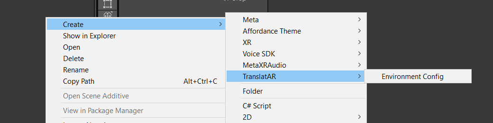
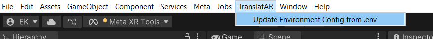

# TranslatAR

## Prerequisites

### Core Tools

- **Docker Desktop**: For running the services. [Download here](https://docs.docker.com/desktop/).
- **make**: A command-line tool for running project commands.
  - **macOS:** Pre-installed. May require `xcode-select --install`.
  - **Windows:** Install via Chocolatey: `choco install make`.
  - **Linux (Debian/Ubuntu):** `sudo apt install make`.

- **(Optional) For GPU acceleration:**
  - A [CUDA-capable NVIDIA GPU](https://developer.nvidia.com/cuda-gpus).
  - [NVIDIA Container Toolkit](https://docs.nvidia.com/datacenter/cloud-native/container-toolkit/install-guide.html) installed.

### Local Development & Code Quality

While Docker can run the project, local development (running tests, formatters, and managing dependencies) requires the following:

- **Python**: Both versions **3.10** and **3.11** are required for the different microservices. instructions on installing different Python versions are available in our [Python Service Developer Guide](./docs/developer_guide.python_services.md#prerequisites).
- **Node.js**: Required for the `web-portal`. [Download here](https://nodejs.org/en/download).
- **Poetry**: The dependency manager for Python services. [Installation guide](https://python-poetry.org/docs/#installation).
- [**pre-commit**](https://pre-commit.com/): For managing automated code quality hooks. Install with `pipx install pre-commit`.
  - [`pipx` installation instructions](https://pipx.pypa.io/stable/installation/).

### Unity

- [Unity Hub](https://docs.unity3d.com/hub/manual/InstallHub.html). The guide below will instruct you on installing the correct Unity Editor version.

## Common Commands

This project uses a `Makefile` to provide simple commands for common operations. Below is a list of some of the most frequently used ones.

Run `make` or `make help` at any time to see the list of all available commands.

| Command                 | Description                                                                         |
| ----------------------- | ----------------------------------------------------------------------------------- |
| `make up`               | Build and start all services in Docker (auto-detects GPU).                          |
| `make down`             | Stop and remove all services.                                                       |
| `make restart`          | Restart all services.                                                               |
| `make logs <service>`   | Show logs of a specific service (e.g., `backend`).                                  |
| `make unity-editor`     | Open the Unity project (`unity/`) in the Unity Edtitor (requires macOS or Windows). |
| `make test`             | Run all applicable test suites (Unit, Integration, and Unity).                      |

## Quick Links

Web Portal: <http://localhost:5173>

## Further Documentation

- **Service-Specific READMEs:** Each microservice has its own `README.md` with information about its tech stack, dependency management, and local testing procedures.
  - [Backend Service](./backend/README.md)
  - [Web Portal](./web-portal/README.md)
  - [Speech-to-Text Service](./stt-service/README.md)
  - [Translation Service](./translation-service/README.md)
  - [Summarization Service](./summarization-service/README.md)
  - [Unity Frontend](./unity/README.md)

- **Scripts:** a collection of shell and Python scripts used by the project (specicially `make`).
  - [Scripts README](./scripts/README.md)

- **Developer Guides:**
  - [Python Services Development Guide](./docs/developer_guide.python_services.md)
  - [VS Code Dev Containers Guide](./docs/dev_container.md)

- **Live API Documentation (FastAPI):** The FastAPI Python services automatically generate interactive API documentation. Once the services are running (`make up`), you can access them at:
  - **Backend Service**:
    - **Swagger UI:** <http://localhost:8000/docs>
    - **ReDoc:** <http://localhost:8000/redoc>

  - **Speech-to-Text Service:**
    - **Swagger UI:** <http://localhost:9000/docs>
    - **ReDoc:** <http://localhost:9000/redoc>

  - **Translation Service:**
    - **Swagger UI:** <http://localhost:9001/docs>
    - **ReDoc:** <http://localhost:9001/redoc>

  - **Summarization Service:**
    - **Swagger UI:** <http://localhost:9002/docs>
    - **ReDoc:** <http://localhost:9002/redoc>

## Set Up

### Initial set up

First, ensure all [prerequisites](#prerequisites) are met and Docker is running.

1. Clone this repository and enter the directory:

    ```sh
    git clone https://github.com/TransatAR-Dev-Team/TranslatAR.git && cd TranslatAR
    ```

2. Set up `.env` file. Copy the template to the real file:

    ```sh
    cp .env.example .env
    ```

    Then follow the instructions in `.env` and add the missing values.

3. Activate `pre-commit`. These commands install the pre-commit hooks into your local git configuration and downloaded the needed dependencies. `pre-commmit` will automatically format and lint your code every time you commit. **This is a required step for all contributors.** This step is only required once per clone. Download the hooks takes several minutes.

    ```sh
    pre-commit install
    pre-commit run
    ```

    `pre-commit` will now run its hooks whenever you make a commit. Read more [here](#code-quality).

4. Start all the backend services. This runs a script that will automatically detect if you have an NVIDIA GPU and apply the correct configuration. The first time you run this, it may take a while to download and build the Docker images.

    ```sh
    make up
    ```

5. Go to <http://localhost:5173> (Web Portal) and <http://localhost:8000/docs> (Backend Auto Documentation) to verify the containers are running.

6. If this is your first time setting up the project, download the LLM model for the summarization service. You only need to do this once.

    ```sh
    docker exec -it ollama ollama pull phi3:mini
    ```

### Unity Frontend

1. Install [Unity Hub](https://docs.unity3d.com/hub/manual/InstallHub.html)

    > Unity Hub has a [CLI tool](https://docs.unity3d.com/hub/manual/HubCLI.html) that can do everything needed to set up the environment. This guide will continue without using the CLI tool.

2. Open *Projects* tab and click *Add ⌄*

3. In the dropdown, select *Add project from disk*

4. Locate this repository in your file system and select the `unity` directory

5. Download Unity version `2022.3.62f1` from the pop up. It should be the recommended version.

6. In the pop up, select *Android build support* and all subitems to be installed as well.

7. Click *Install*. This may take a while to download.

8. Open the project in Unity Hub from the "Projects" list. The project should look like a blank 3D area with a floating text box.

9. In the Unity Editor's taskbar, check *Meta* > *Meta XR Simulator* > *Activate*

    > Leaving *Meta XR Simulator* set to *Deactivate* only renders the game ojects and saves resources.

    When the simulator is enabled, the "Laptop" button next to the transpot buttons is blue. Example:

    

1.  Load environment variables. In the *Project* tab at the bottom of the editor, navigate to `Assets/Resources` in the file system. Right click within that directory and select *Create* > *TranslatAR* > *Environment Config*.

    Example:

    

    Then, in the menu bar, select *TranslatAR* > *Update Environment Config from .env*.

    Example:

    

## Demo

### Running the demo

To demonstrate the connection between the containerized backend and the Unity frontend, first ensure all [Set Up](#set-up) steps are completed.

1. Press the "Play" button (`▶`) at the top center of the Unity editor window to start the scene.

2. A pop up with the headset simulator should appear.

   > The room you see in the pop up simulates the video passthrough feature of a real Meta Quest headset, where you would instead see your actual physical surroundings through the device's cameras.

   The text on the simulator screen will prompt you: *"Press and hold (B) or Left Click to record."*.

   Walk around with `W`, `A`, `S`, and `D` keys. Look around with the arrow keys.

3. In the Unity Editor, click the *Login* button. Navigate to <https://google.com/device> and enter the code on screen. Authorize the login with your Google account. In a moment, the panel will welcome you with your "username".

4. **Click your mouse inside the simulator window** to give it focus.

5. **Press and hold the `B` button**. The text will change to *"Recording..."*. Speak into your computer's microphone.

6. **Release the `B` button**. The text will change to *"Processing audio..."*.

7. After a moment, the text will update with the Spanish translation of what you said.

8. Go to <http://localhost:5173> to see the web portal. The new translation you just created will be at the top of the history log.

9. Click the *Login* button in the upper right corner. Login with a google account. Your email will apear next to the login button. You can then click *Logout*.

10. Repeat steps 4-6 to add more translations. Refresh the web portal to see the history update.

11. Type/copy some text into the "Summarize Text" text box on the web portal. Select a summary length (short, medium, long) and click the "Summarize" button. A summary of the text will be generated.

### Demo clean up

1. Press the "Stop" button (`⏹`) in the Unity Editor.
2. Shut down all Docker containers:

    ```sh
    make down
    ```

## Testing

Ensure all [Prerequisites](#prerequisites) are met and the project has been [Set Up](#set-up) before running tests.

### Running the Full Test Suite

This is the main command you should run before committing code. On macOS and Windows, this will run everything. On Linux, it will run the backend tests and print a warning that the Unity tests are being skipped.

```sh
make test
```

### Running Specific Test Suites

To run only unit tests for all services, use the following command. This is useful for quickly checking for errors.

```sh
make test-unit
```

To run only the integration tests, use this command. These tests take longer to run.

```sh
make test-integration
```

To run only the Unity **Edit Mode** and **Play Mode** tests, use the script below. This requires a local installation of the correct Unity Editor version and can only be run on **macOS or Windows**.

```sh
make test-unity
```

This test suite takes the longest to run, especially if you haven't run it before.

### Running Individual Service Tests Locally

For rapid development, you can run tests for individual services on your local machine without Docker or scripts. Before running tests, you must navigate to the service's directory and install its dependencies.

Instructions for each service can be found at the links below:

- [Web Portal (`web-portal`)](./web-portal/README.md#local-testing)
- [Python Services (`backend`, etc.)](./docs/developer_guide.python_services.md#local-testing)
- [Unity (`unity`)](./unity/README.md#testing)

## Code Quality

To ensure code consistency and quality, this project uses `pre-commit` to run checks and automatically make changes on each file you commit. These checks include formatters and linters such as:

- **Python Services**: Formatted with **Black** and linted with **Ruff**.
- **Web Portal**: Formatted with **Prettier** and linted with **ESLint**.
- **Security**: Secret detection to prevent committing credentials.
- **General**: Checks for whitespace, file endings, and other common issues.

The full configuration can be found in the [`.pre-commit-config.yaml`](./.pre-commit-config.yaml) file.

### When a commit is rejected

If your `git commit` is blocked, it means the hooks caught an issue. There are two scenarios.

1. **The hooks have made automatic changes to your files.**

    A formatter has fixed your code for you. Stage the changes and try to commit again.

    ```sh
    git add .
    git commit
    ```

2. **The errors need a manual fix.**

    Read the error messages carefully. It will tell you the file, line number, and what is wrong. Fix the error, stage the files, and commit again.

    > **Important:** If a secret is detected, **you must remove it.** Do not add it to the baseline file unless you are 100% certain that it is a false positive.

### Running Checks Manually

You can run these checks at any time without creating a commit.

**Using `pre-commit`:**

To run on only staged files:

```sh
pre-commit run
```

To run on any modified files (staged or not)

```sh
pre-commit run --files $(git ls-files -m)
```

To run on all files:

```sh
pre-commit run --all-files
```

**Using `make`:**

To format and lint all code:

```sh
make validate
```

To format all code:

```sh
make format
```

To lint all code:

```sh
make lint
```

For instructions on running  tools within a specific service, see the developer guides for [Python services](./docs/developer_guide.python_services.md#formatting-and-linting) and the [Web Portal](./web-portal/README.md#formatting-and-linting).
