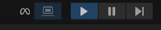
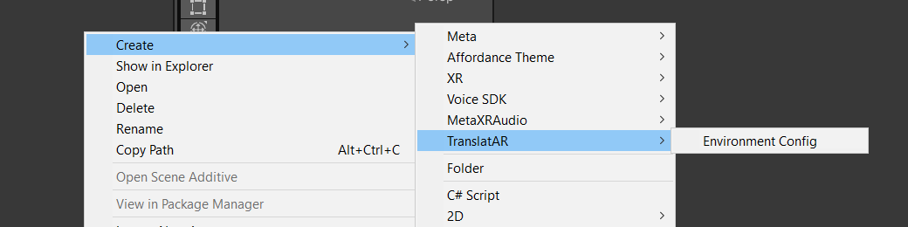
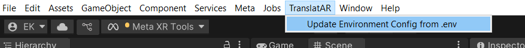

# TranslatAR

TranslatAR bridges language barriers via a secure, containerized platform that combines real-time AR translation on Meta Quest with AI-powered conversation insights and a companion web portal.

## About the Project

TranslatAR utilizes a Unity-based XR client for the Meta Quest with a containerized microservices backend and web portal to provide instant speech-to-text transcription, multi-language translation, and AI-powered conversation summarization and language learning advice.

Secure user authentication is managed via Google OAuth 2.0 and JWTs, ensuring data privacy across both the headset and the companion web portal. The entire stack is orchestrated through Docker for a consistent, scalable development and deployment environment.

## Prerequisites

### Core Tools

- **Docker Desktop**: For running the services. [Download here](https://docs.docker.com/desktop/).
- **make**: A command-line tool for running project commands.
  - **macOS:** Pre-installed. May require `xcode-select --install`.
  - **Windows:** Install via Chocolatey: `choco install make`.
  - **Linux (Debian/Ubuntu):** `sudo apt install make`.

- **(Optional) For GPU acceleration:**
  - A [CUDA-capable NVIDIA GPU](https://developer.nvidia.com/cuda-gpus).
  - [NVIDIA Container Toolkit](https://docs.nvidia.com/datacenter/cloud-native/container-toolkit/install-guide.html) installed.

### Local Development & Code Quality

While Docker can run the project, local development (running tests, formatters, and managing dependencies) requires the following:

- **Python**: Both versions **3.10** and **3.11** are required for the different microservices. instructions on installing different Python versions are available in our [Python Service Developer Guide](./docs/developer_guide.python_services.md#prerequisites).
- **Node.js**: Required for the `web-portal`. [Download here](https://nodejs.org/en/download).
- **Poetry**: The dependency manager for Python services. [Installation guide](https://python-poetry.org/docs/#installation).
- [**pre-commit**](https://pre-commit.com/): For managing automated code quality hooks. Install with `pipx install pre-commit`.
  - [`pipx` installation instructions](https://pipx.pypa.io/stable/installation/).

### Unity

- [Unity Hub](https://docs.unity3d.com/hub/manual/InstallHub.html). The guide below will instruct you on installing the correct Unity Editor version.

## Common Commands

This project uses a `Makefile` to provide simple commands for common operations. Below is a list of some of the most frequently used ones (non-exhaustive).

Run `make` or `make help` at any time to see the list of all available commands.

| Command                 | Description                                                                         |
| ----------------------- | ----------------------------------------------------------------------------------- |
| `make up`               | Build and start all services in Docker (auto-detects GPU).                          |
| `make down`             | Stop and remove all services.                                                       |
| `make restart`          | Restart all services.                                                               |
| `make logs <service>`   | Show logs of a specific service (e.g., `backend`).                                  |
| `make unity-editor`     | Open the Unity project (`unity/`) in the Unity Edtitor (requires macOS or Windows). |
| `make test`             | Run all applicable test suites (Unit, Integration, and Unity).                      |
| `make coverage-report`  | Generate and open test coverage report in browser. Installs dependencies.           |
| `make` or `make help`   | Show exhastive list of all available commands.                                      |

## Further Documentation

- **Service-Specific READMEs:** Each microservice has its own `README.md` with information about its tech stack, dependency management, and local testing procedures.
  - [Backend Service](./backend/README.md)
  - [Web Portal](./web-portal/README.md)
  - [Speech-to-Text Service](./stt-service/README.md)
  - [Translation Service](./translation-service/README.md)
  - [Summarization Service](./summarization-service/README.md)
  - [Unity Frontend](./unity/README.md)

- **Scripts:** a collection of shell and Python scripts used by the project primarily through `make`.
  - [Scripts README](./scripts/README.md)

- **Developer Guides:**
  - [Python Services Development Guide](./docs/developer_guide.python_services.md)
  - [Testing](./docs/testing.md).
  - [Code Quality](./docs/code_quality.md).
  - [VS Code Dev Containers Guide](./docs/dev_container.md)

- **Live API Documentation (FastAPI):** The FastAPI Python services automatically generate interactive API documentation. Once the services are running (`make up`), you can access them at:
  - **Backend Service**:
    - **Swagger UI:** <http://localhost:8000/docs>
    - **ReDoc:** <http://localhost:8000/redoc>

  - **Speech-to-Text Service:**
    - **Swagger UI:** <http://localhost:9000/docs>
    - **ReDoc:** <http://localhost:9000/redoc>

  - **Translation Service:**
    - **Swagger UI:** <http://localhost:9001/docs>
    - **ReDoc:** <http://localhost:9001/redoc>

  - **Summarization Service:**
    - **Swagger UI:** <http://localhost:9002/docs>
    - **ReDoc:** <http://localhost:9002/redoc>

## Set Up

### Initial set up

First, ensure all [prerequisites](#prerequisites) are met and Docker is running.

1. Clone this repository and enter the directory:

    ```sh
    git clone https://github.com/TransatAR-Dev-Team/TranslatAR.git && cd TranslatAR
    ```

2. Set up `.env` file. Copy the template to the real file:

    ```sh
    cp .env.example .env
    ```

    Then follow the instructions in `.env` and add the missing values.

3. Activate `pre-commit`. These commands install the pre-commit hooks into your local git configuration and downloaded the needed dependencies. `pre-commmit` will automatically format and lint your code every time you commit. **This is a required step for all contributors.** This step is only required once per clone. Download the hooks takes several minutes.

    ```sh
    pre-commit install
    pre-commit run
    ```

    `pre-commit` will now run its hooks whenever you make a commit. Read more [here](#code-quality).

4. Start all the backend services. This runs a script that will automatically detect if you have an NVIDIA GPU and apply the correct configuration. The first time you run this, it may take a while to download and build the Docker images.

    ```sh
    make up
    ```

5. Go to <http://localhost:5173> (Web Portal) and <http://localhost:8000/docs> (Backend Auto Documentation) to verify the containers are running.

6. If this is your first time setting up the project, download the LLM model for the Summarization Service. You only need to do this once.

    ```sh
    docker exec -it ollama ollama pull phi3:mini
    ```

### Unity Frontend

1. Install [Unity Hub](https://docs.unity3d.com/hub/manual/InstallHub.html)

    > Unity Hub has a [CLI tool](https://docs.unity3d.com/hub/manual/HubCLI.html) that can do everything needed to set up the environment. This guide will continue without using the CLI tool.

2. Open *Projects* tab and click *Add ⌄*

3. In the dropdown, select *Add project from disk*

4. Locate this repository in your file system and select the `unity` directory

5. Download Unity version `2022.3.62f1` from the pop up. It should be the recommended version.

6. In the pop up, select *Android build support* and all subitems to be installed as well.

7. Click *Install*. This may take a while to download.

8. Open the project in Unity Hub from the "Projects" list. The project should look like a blank 3D area with a floating text box.

9. In the Unity Editor's taskbar, check *Meta* > *Meta XR Simulator* > *Activate*

    > Leaving *Meta XR Simulator* set to *Deactivate* only renders the game ojects and saves resources.

    When the simulator is enabled, the "Laptop" button next to the transpot buttons is blue. Example:

    

1.  Load environment variables. In the *Project* tab at the bottom of the editor, navigate to `Assets/Resources` in the file system. Right click within that directory and select *Create* > *TranslatAR* > *Environment Config*.

    Example:

    

    Then, in the menu bar, select *TranslatAR* > *Update Environment Config from .env*.

    Example:

    

## Demo

See [Running the Demo](./docs/demo.md).

## Testing

See [Testing](./docs/testing.md).

## Code Quality

See [Code Quality](./docs/code_quality.md).
